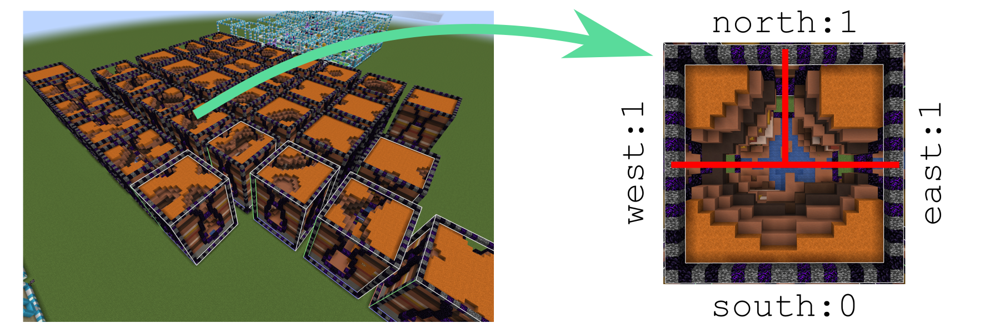

# Procedural Dungeons // pd_maps

Maps sub-repo of the Procedural Dungeons pack providing [map items](#maps) and a [map device](#map-device). In combination, these offer a similar approach to procedurally generated levels as the Action RPB [Path of Exile](https://www.pathofexile.com/) as *map items* encode the properties of a level which can then be accessed by putting the item in the *map device* structure and *opening* it.

### Maps

Map items encode all properties of level generation which can be passed as parameters to the [`pd_generation`](../pd_generation) package. They often come with randomized parameters to provide more variety.

Most importantly, map items encode the linear extent of the level, as well as the tileset and algorithm.

### Map device
