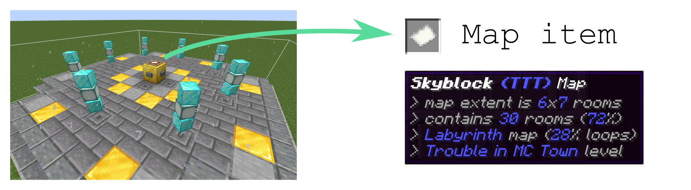
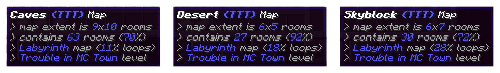

# Procedural Dungeons // pd_maps

Maps sub-repo of the Procedural Dungeons pack providing [map items](#maps) and a [map device](#map-device). In combination, these offer an approach to procedurally generated levels which is similar to the Action RPB [Path of Exile](https://www.pathofexile.com/). *Map items* encode the properties of a level which can then be accessed by putting the item in the *map device* structure and *opening* it. In fact, the map system was implemented first into the datapack as an attempt to enter Path of Exile's talent competition with a [video](https://www.youtube.com/watch?v=Q7MZA2epbMU) entry.




### Maps

Map items encode all properties of level generation which can be passed as parameters to the [`pd_generation`](../pd_generation) package. They often come with randomized parameters to provide more variety.



Most importantly, map items encode the linear extent of the level, as well as the tileset and algorithm.

Map items can be obtained by using functions. For each map item, there is a function which gives the player a single map with randomized parameters. The functions for already implemented maps are
```mcfunction
function pd_maps:maps/get_bunny_jump_ttt_map
function pd_maps:maps/get_canyon_ttt_map
function pd_maps:maps/get_caves_ttt_map
function pd_maps:maps/get_desert_ttt_map
function pd_maps:maps/get_sewers_ttt_map
function pd_maps:maps/get_skyblock_ttt_map
```


### Map device

The *map device* is a structure which can accept *map items* in its central item frame and call level generation with the map parameters. To do so, one only has to place a map item in the item frame and push one of the buttoms on the gold block. Upon successful level generation, portals are opened to the starting area of the level.

The map device structure is available as an `.nbt` file [here](structures/map_device.nbt), i.e. has the in-game reference
```
pd_maps:map_device
```
For simplicity, it can also be obtained for the player as a structure block (with the data already filled out) by calling
```mcfunction
loot give @s loot pd_maps:map_device
```


### Adding custom maps

The `pd_maps` package can be extended by adding more new map items. In principle, all one has to do is to implement a new `get_map` function, similar to the ones already implemented (e.g. [`get_caves_ttt_map`](functions/maps/get_caves_ttt_map.mcfunction) for the caves map).

These functions have to have the following structure:

1. **Clear storage**

    Storage fields in `procedural_dungeons:current_map` are cleared by calling the function
    ```mcfunction
    function pd_maps:maps/storage_access/reset_current_map
    ```

2. **Set Parameters**

    There are several parameters which are required or optional to be set in the data storage `procedural_dungeons:current_map`:
    - *Map ID* gives the numeric identifier of level data which is matched with a leveldata set in the [`load_level_data`](../pd_generation/functions/leveldata/load_level_data.mcfunction) function of the `pd_generation` package. Setting the id can be done with e.g.
        ```mcfunction
        data modify storage procedural_dungeons:current_map id set value -2
        ```
    - *Display name* is a descriptive field to provide a *name* for the map item. Setting this field can be done with e.g.
        ```mcfunction
        data modify storage procedural_dungeons:current_map display_name set value "Caves"
        ```
    - *Algorithm* determines the algorithm for generating the level. Here, an integer is required which matches the integer numbers of algorithms in the `pd_generation` package. It is therefore advised to use the following syntax to set it:
        ```mcfunction
        execute store result storage procedural_dungeons:current_map algorithm int 1 run scoreboard players get %ALG_1_LABYRINTH pd_level_parameters
        ```
    - *TTT (yes/no)* determines if the level is used to play [Trouble in MC Town](https://github.com/janattig/Trouble-In-MC-Town), a Trouble in Terrorist Town (TTT) implementation for Minecraft. If no information is given, it is currently assumed to be the case.
        ```mcfunction
        data modify storage procedural_dungeons:current_map is_ttt set value 1
        ```
    - *Extent / Level size* can be determined in several ways. First and foremost, an explicit boundary of the room grid can be specified by setting the following storage values:
        ```mcfunction
        data modify storage procedural_dungeons:current_map min_x set value -3
        data modify storage procedural_dungeons:current_map max_x set value 2
        data modify storage procedural_dungeons:current_map min_z set value -2
        data modify storage procedural_dungeons:current_map max_z set value 1
        ```
        for simplicitly, one can also give the extent in the cardinal directions
        ```mcfunction
        data modify storage procedural_dungeons:current_map extent_x set value 6
        data modify storage procedural_dungeons:current_map extent_z set value 4
        ```
        or even the general extent in both directions
        ```mcfunction
        data modify storage procedural_dungeons:current_map extent set value 6
        ```
        If the level size should be random, the extent can also be drawn randomly upon calling the function by providing boundaries instead of the actual extents
        ```mcfunction
        data modify storage procedural_dungeons:current_map extent_x_min set value 5
        data modify storage procedural_dungeons:current_map extent_x_max set value 10
        data modify storage procedural_dungeons:current_map extent_z_min set value 5
        data modify storage procedural_dungeons:current_map extent_z_max set value 10
        ```
        or if both extents should be drawn from the same range (but independently)
        ```mcfunction
        data modify storage procedural_dungeons:current_map extent_min set value 5
        data modify storage procedural_dungeons:current_map extent_max set value 10
        ```
        Depending on the chosen parameters, the other ones are complemented in step 3 of the function.


3. **Finalize storage**

    By calling the function
    ```mcfunction
    function pd_maps:maps/storage_access/finish_map
    ```
    all storage fields are finalized. This includes setting optional parameters, fixing the actual values for parameters which only had a range given so far, and setting scoreboard values for further steps to proceed properly.

4. **Give actual map item**

    The actual map item is generated and given to the player (who calls the function)
    ```mcfunction
    loot give @s loot pd_maps:current_map
    ```
    Within the loot table, data from the data storage `procedural_dungeons:current_map` is copied onto the item and the description of the item is compiled.
