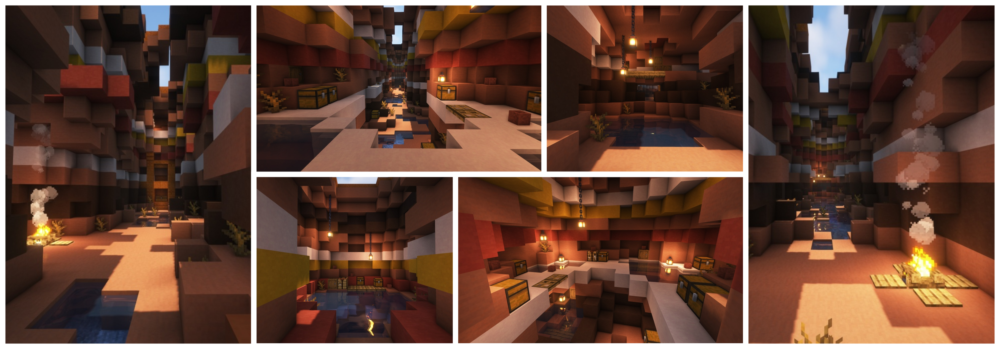

# Procedural Dungeons // procedural_dungeons

Sub-repo of the Procedural Dungeons pack providing a unifying namespace for functions with easy access as well as providing the structure data for levels. For a comprehensive summary of the Procedural Dungeons datapack, see the [main page](https://github.com/janattig/Procedural-Dungeons).

The following functions are provided:

1. **Obtaining a random (TTT) map**

    These maps are used to play [Trouble in MC Town](https://github.com/janattig/Trouble-In-MC-Town) and provided approriate start structures upon creation. A random map (among those implemented in the [pd_maps](../pd_maps/) subpackage of Procedural Dungeons) can be obtained by calling
    ```mcfunction
    function procedural_dungeons:get_random_ttt_map
    ```

2. **Obtaining a map device**

    To generate any level, a map item has to be placed inside a [map device](../pd_maps#map-device). A simple map device can be obtained by calling
    ```mcfunction
    function procedural_dungeons:get_map_device
    ```
    and an extended version (also containing dispensers for different maps) is accessible by
    ```mcfunction
    function procedural_dungeons:get_map_device_extended
    ```


## Showcase: Map themes

The following list provides an overview over the different map themes, currently implemented into Procedural Dungeons. All screenshots are captured using [Complementary Shaders](https://www.curseforge.com/minecraft/customization/complementary-shaders).


### Bunny Jump

A map covered in slime blocks (so you can jump once you fall down). A parcour-like structure is generated in each level, connecting between different obstacles. However, the slime area is open to be walked and you can find your way back to the obstacle course at several occasions.


### Canyon

A beautiful labyrinth of canyons is carved into the landscape. You walk across their bottom, between remainders of water (from a previous rain?). Hiding spots for loot are carved into the canyon walls and if you are lucky you might discover relicts of an ancient civilization, long gone.




### Caves

Caves underground, narrow and tightly curving. You can find ancient ruins here, as well as remainders of previous digging attempts. Be careful to not get lost!


### Desert

The desert awaits you as you walk across it. When traversing the terrain, you can find ruins and dunes, reminding you of egypting mythology. If you are lucky, you also find an opening to the rich underworld of the desert, where ancient stashes await you in giant hallways.


### Sewers

The sewers is a dark but surprisingly clean place. You can walk for miles along the tunnels or even attempt to take a swim. Be aware of the path you take or you might get lost in the huge maze underground.


### Skyblock

Islands floating in the sky, connected by small and nimble bridges - do I need to say more? Don't fall down, but enjoy the view!


